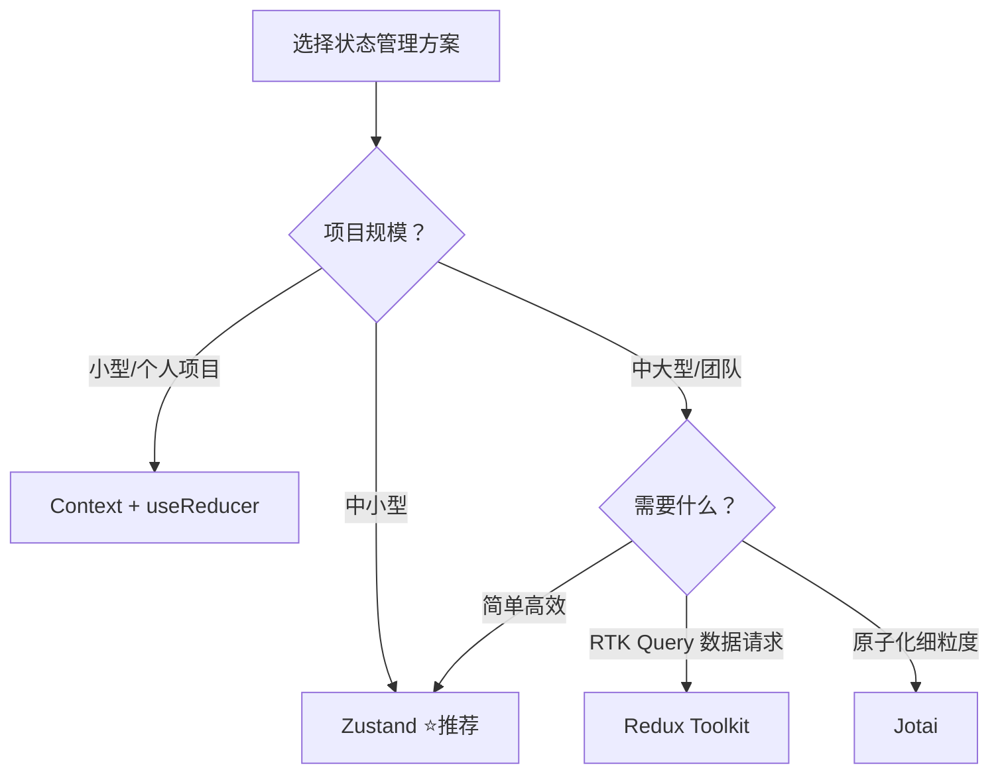

# React 状态管理方案对比

## 概要

React 生态中状态管理方案繁多，从内置的 Context + useReducer 到轻量的 Zustand、Jotai，再到重量级的 Redux Toolkit。本文对比主流方案的特点、适用场景和选型建议。

## 一、方案总览

| 方案 | 包大小 | 学习成本 | 适用规模 | 核心理念 |
| --- | --- | --- | --- | --- |
| **Context + useReducer** | 0 (内置) | 低 | 小型 | 原生方案，无需第三方 |
| **Zustand** | ~1KB | 低 | 中小型 | 极简 API，基于发布订阅 |
| **Jotai** | ~2KB | 低 | 中小型 | 原子化状态，类似 Recoil |
| **Redux Toolkit** | ~11KB | 中高 | 中大型 | 单向数据流，中间件生态丰富 |
| **Valtio** | ~2KB | 低 | 中小型 | 代理模式，可变突变 |

## 二、Context + useReducer（内置方案）

适合 ==简单全局状态==，无需安装任何依赖。

```tsx
// store/AuthContext.tsx
import { createContext, useContext, useReducer } from 'react'

// 1. 定义类型
interface AuthState {
  user: { name: string } | null
  isAuthenticated: boolean
}

type AuthAction =
  | { type: 'LOGIN'; payload: { name: string } }
  | { type: 'LOGOUT' }

// 2. 创建 Context
const AuthContext = createContext<{
  state: AuthState
  dispatch: React.Dispatch<AuthAction>
} | null>(null)

// 3. Reducer
function authReducer(state: AuthState, action: AuthAction): AuthState {
  switch (action.type) {
    case 'LOGIN':
      return { user: action.payload, isAuthenticated: true }
    case 'LOGOUT':
      return { user: null, isAuthenticated: false }
    default:
      return state
  }
}

// 4. Provider
export function AuthProvider({ children }: { children: React.ReactNode }) {
  const [state, dispatch] = useReducer(authReducer, {
    user: null,
    isAuthenticated: false,
  })
  return (
    <AuthContext.Provider value={{ state, dispatch }}>
      {children}
    </AuthContext.Provider>
  )
}

// 5. Hook
export function useAuth() {
  const context = useContext(AuthContext)
  if (!context) throw new Error('useAuth must be within AuthProvider')
  return context
}
```

```tsx
// 使用
function LoginButton() {
  const { dispatch } = useAuth()
  return (
    <button onClick={() => dispatch({ type: 'LOGIN', payload: { name: 'zeMinng' } })}>
      登录
    </button>
  )
}

function UserInfo() {
  const { state } = useAuth()
  return <span>{state.user?.name ?? '未登录'}</span>
}
```

### 1. Context 的局限性

| 问题 | 说明 |
| --- | --- |
| **性能** | 任意值变化会导致所有消费者重渲染（除非用 `useMemo` / 拆分 Context） |
| **不适合高频更新** | 每次更新走 React 渲染周期，高频场景（动画、输入）性能差 |
| **调试困难** | 无内置 DevTools 支持 |

## 三、Zustand（推荐）

==体积最小、API 最简单==，适合绝大部分中小型项目。

```bash
npm i zustand
```

```tsx
// store/useBearStore.ts
import { create } from 'zustand'

interface BearState {
  bears: number
  increase: () => void
  decrease: () => void
  reset: () => void
}

export const useBearStore = create<BearState>((set) => ({
  bears: 0,
  increase: () => set((state) => ({ bears: state.bears + 1 })),
  decrease: () => set((state) => ({ bears: state.bears - 1 })),
  reset: () => set({ bears: 0 }),
}))
```

```tsx
// 组件中使用
function BearCounter() {
  // 选择器：只在 bears 变化时重渲染
  const bears = useBearStore((state) => state.bears)
  return <h1>{bears} 只熊</h1>
}

function Controls() {
  // 只订阅 actions，不会因 bears 变化重渲染
  const increase = useBearStore((state) => state.increase)
  return <button onClick={increase}>+1</button>
}
```

### 1. Zustand 高级用法

```tsx
// 1. 切片模式 — 拆分大型 store
interface FishSlice {
  fishes: number
  addFish: () => void
}

const createFishSlice = (set) => ({
  fishes: 0,
  addFish: () => set((state) => ({ fishes: state.fishes + 1 })),
})

const useBoundStore = create<BearState & FishSlice>((...args) => ({
  ...createBearSlice(...args),
  ...createFishSlice(...args),
}))

// 2. 中间件 — persist（持久化）
import { persist } from 'zustand/middleware'

export const useStore = create(
  persist(
    (set) => ({
      token: '',
      setToken: (token: string) => set({ token }),
    }),
    {
      name: 'auth-storage', // localStorage key
      partialize: (state) => ({ token: state.token }), // 只持久化 token
    }
  )
)

// 3. 中间件 — devtools
import { devtools } from 'zustand/middleware'

export const useStore = create(
  devtools(
    (set) => ({
      count: 0,
      increment: () => set((s) => ({ count: s.count + 1 }), false, 'increment'),
    }),
    { name: 'MyStore' }
  )
)

// 4. 在 React 组件外读写（适合拦截器、工具函数）
const token = useStore.getState().token   // 读取
useStore.setState({ token: 'new' })       // 写入
useStore.subscribe(console.log)           // 订阅
```

## 四、Redux Toolkit（重量级）

适合 ==大型团队协作==、==复杂状态逻辑==，但学习成本较高。

```bash
npm i @reduxjs/toolkit react-redux
```

```tsx
// store/counterSlice.ts
import { createSlice, PayloadAction } from '@reduxjs/toolkit'

const counterSlice = createSlice({
  name: 'counter',
  initialState: { value: 0 },
  reducers: {
    increment: (state) => {
      state.value += 1  // Immer 允许直接"修改"
    },
    incrementByAmount: (state, action: PayloadAction<number>) => {
      state.value += action.payload
    },
  },
})

export const { increment, incrementByAmount } = counterSlice.actions
export default counterSlice.reducer
```

```tsx
// store/index.ts
import { configureStore } from '@reduxjs/toolkit'
import counterReducer from './counterSlice'

export const store = configureStore({
  reducer: {
    counter: counterReducer,
  },
})

export type RootState = ReturnType<typeof store.getState>
export type AppDispatch = typeof store.dispatch

// hooks.ts — 类型化 hooks
import { useDispatch, useSelector } from 'react-redux'
export const useAppDispatch = () => useDispatch<AppDispatch>()
export const useAppSelector: TypedUseSelectorHook<RootState> = useSelector
```

```tsx
// 组件使用
function Counter() {
  const count = useAppSelector((state) => state.counter.value)
  const dispatch = useAppDispatch()

  return (
    <div>
      <span>{count}</span>
      <button onClick={() => dispatch(increment())}>+</button>
    </div>
  )
}
```

### 1. Redux 异步操作 (RTK Query)

```tsx
import { createApi, fetchBaseQuery } from '@reduxjs/toolkit/query/react'

export const api = createApi({
  reducerPath: 'api',
  baseQuery: fetchBaseQuery({ baseUrl: '/api' }),
  endpoints: (builder) => ({
    getUsers: builder.query<User[], void>({
      query: () => '/users',
    }),
    updateUser: builder.mutation<User, Partial<User>>({
      query: (body) => ({ url: `/users/${body.id}`, method: 'PUT', body }),
    }),
  }),
})

export const { useGetUsersQuery, useUpdateUserMutation } = api

// 使用：自动管理 loading / error / data
function UserList() {
  const { data, isLoading, error } = useGetUsersQuery()
  const [updateUser] = useUpdateUserMutation()

  if (isLoading) return <div>加载中...</div>
  return data?.map(user => <div key={user.id}>{user.name}</div>)
}
```

## 五、Jotai（原子化）

灵感来自 Recoil，==每个状态是一个原子==，精确订阅。

```bash
npm i jotai
```

```tsx
import { atom, useAtom, useAtomValue } from 'jotai'

// 1. 定义原子
const countAtom = atom(0)
const doubleAtom = atom((get) => get(countAtom) * 2)  // 派生原子

// 2. 使用
function Counter() {
  const [count, setCount] = useAtom(countAtom)
  const double = useAtomValue(doubleAtom)  // 只读
  
  return (
    <div>
      <p>Count: {count}</p>
      <p>Double: {double}</p>
      <button onClick={() => setCount(c => c + 1)}>+1</button>
    </div>
  )
}

// 3. 异步原子
const userAtom = atom(async () => {
  const res = await fetch('/api/user')
  return res.json()
})

function UserInfo() {
  const user = useAtomValue(userAtom)  // 配合 Suspense
  return <div>{user?.name}</div>
}
```

## 六、选型建议



| 场景 | 推荐方案 | 理由 |
| --- | --- | --- |
| 快速原型 / 小项目 | **Context + useReducer** | 零依赖，够用 |
| 中小型应用（默认推荐） | **Zustand** | API 最简单，性能好 |
| 需要数据请求缓存 | **Redux Toolkit + RTK Query** | 完整的请求状态管理 |
| 细粒度状态订阅 | **Jotai** | 组件级精确渲染 |
| 团队已有 Redux 经验 | **Redux Toolkit** | 减少迁移成本 |
| 需要在组件外使用 | **Zustand** | 天然支持组件外读写 |

::: tip 个人推荐
**Zustand** 是当前性价比最高的方案——体积仅 1KB，API 5 分钟学会，性能优秀，TypeScript 支持好。除非有明确的 RTK Query 需求，否则 Zustand 足够覆盖 90% 的状态管理场景。
:::

## 小结

React 状态管理方案的选择核心看 ==项目规模== 和 ==团队经验==。**Zustand** 是当前性价比最高的选择——1KB 体积、5 分钟上手、性能优秀，覆盖 90% 场景。小型项目用 Context + useReducer 零依赖即可，大型团队或需要 RTK Query 数据缓存时考虑 Redux Toolkit，细粒度状态订阅场景选 Jotai。关键在于选择最适合团队和项目的方案，而非盲目追新。

::: info 📖 参考
- [Zustand 文档](https://docs.pmnd.rs/zustand)
- [Redux Toolkit 文档](https://redux-toolkit.js.org/)
- [Jotai 文档](https://jotai.org/)
:::
